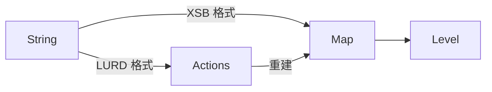

# 设计

## 结构体设计

- `Map`: 存储地图数据.
    - 包含所有地图元素的数组.
    - 包含玩家位置, 箱子和目标位置: 方便快速读取, 否则需要遍历数组来获取相应元素的坐标.
- `Actions`: 存储玩家的动作, 包括动作的类型(移动或推动), 以及方向(上下左右).
- `Level`: 关卡, 包含地图和玩家动作. 可以执行或撤销动作.

将 `Level` 中与地图相关的内容分离到 `Map` 中, 是为了将地图数据与关卡功能分离. 许多涉及地图的操作(例如计算两个地图之间的相似度)与关卡功能无关.

> `Map` 的数组是否应该包含玩家和箱子元素? 🤔
> 
> - 包含:
>     - 在修改玩家位置或移动箱子时, 需要同步数组中的数据. 可能引入导致数据不一致的 BUG. 但因为实现十分简单, 因此引入 BUG 的可能性不大.
>     - 存在数据冗余, 但是冗余的数据量很小, 不至于造成显著的内存占用率变化.
> - 不包含: 读取时需要判断是否与玩家或任意箱子的位置相同, 如果有就追加相关元素的枚举值. 导致读取比写入有更大的开销. 取比写入开销大违反直觉, 违背了 POLA[^POLA].
> 
> 综上所述, 本文倾向于在数组里包含这些元素.

> `Map` 的数组应该是一维的还是二维的? 🤔
> 
> 由于该数组是动态数组, 二维动态数组的分配与释放需要更大的开销. 而使用一维动态数组, 内存布局会更加紧凑, 且可以提供使用二维坐标读取地图内容的关联函数. 因此使用一维数组更为合适.

## 转换关系

[^POLA]: <https://en.wikipedia.org/wiki/Principle_of_least_astonishment>
