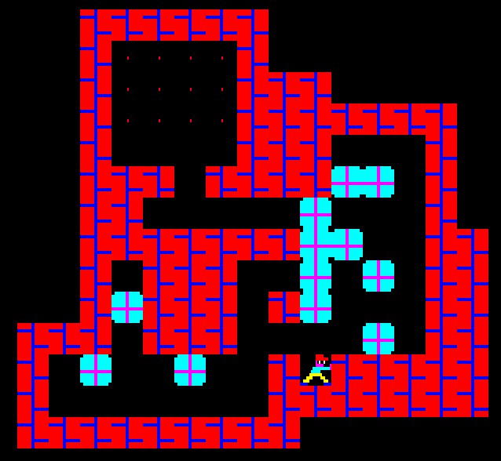
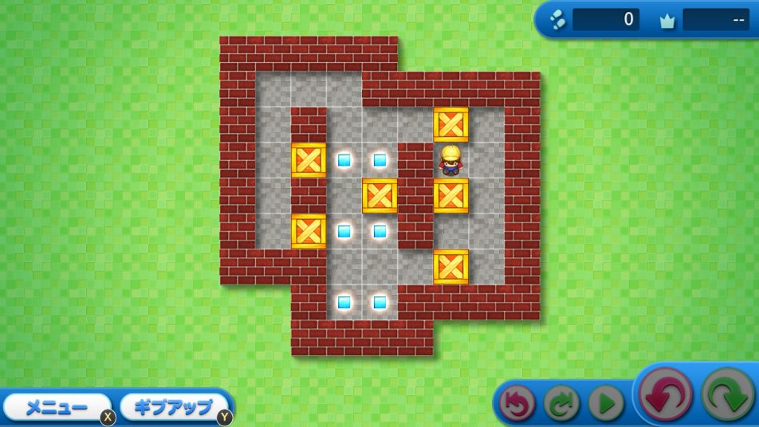

# 介绍

本文将描述如何实现一个推箱子 📦, 示例代码使用 Rust 语言 🦀 编写.

## 推箱子的起源

推箱子在 1981 年由日本人今林宏行(いまばやし ひろゆき)所创造, 第一个版本于 1982 年 12 月发行, 名为*仓库番*, 字面意思为 "仓库管理员" 👷.[^1] 英文名为: Sokoban 或 Soukoban.

截至 2024 年, 最新版本推箱子(みんなの倉庫番)于 2019 年 8 月发行于 PlayStation 4 平台.[^1]

最新版本的推箱子在角色控制方面相较于其最初的版本并未见明显改进, 本文后续将介绍一种纯鼠标控制的角色控制方法 🖱️.

## 为什么通过案例来讲解

本文以推箱子为案例, 深入浅出的描述软件开发过程. 通过案例讲解有以下目的:

- 结合实例的学习可以将**知识**和**应用**结合在一起, 使读者无需被 "学这个有什么用?" 所困扰 🤔.
- 提供丰富的实例. 推箱子问题本身还附带了许多子问题, 很适合作为例子使用.
- 众多读者对游戏有浓厚的兴趣 🎮.

## 为什么选择推箱子作为案例

之所以选择推箱子, 是因为它具有以下特点:

- **规则简单**: 可以专注于实现功能, 而非理解复杂的游戏规则和机制.
- **基本功能易于实现**: 如推箱子和通关判断.
- **有具有挑战的高级功能**: 如纯鼠标控制, 逆推等.
- **有需要深入钻研的求解器**: 用于自动求解推箱子关卡.

推箱子的实现**既可以简单也可以复杂**, 读者可以根据自身的情况选择学习的深度.

## 需要具备的知识

- 具备 Rust 语言的语法基础, 或熟悉一门编程语言.
- 有关高级功能和求解器的章节: 具备数据结构与算法的基础知识, 如 A* 搜索算法的工作原理.

## 内容范围

本文将描述基本功能的具体实现方法, 高级功能的实现方法以及求解器的实现思路.  
但本文**不涉及**以下内容:

- Rust 语言本身: 本文中出现的算法适用于其他编程语言, 但依然会涉及部分 Rust 相关内容的讲解, 如错误处理 (Rust 在这方面和其他语言不太一样), 不感兴趣的读者可以直接跳过这部分内容.
- 游戏引擎: 本文中的推箱子实现并不依赖游戏引擎, 比如有的推箱子实现需要用到射线检测.
- 推箱子的其他变体(Variant)[^2].

## 项目代码

完整的项目代码位于:

- [ShenMian/soukoban](https://github.com/shenmian/soukoban): 推箱子相关算法实现.
- [ShenMian/sokoban-rs](https://github.com/shenmian/sokoban-rs): 推箱子实现, 使用 Bevy 引擎.

## 拓展资料

推荐视频 🎥:

- [【GM】火遍全球的推箱子，那些你所不知道的故事！· Bilibili](https://www.bilibili.com/video/BV1Ph41117YT): 该视频详细介绍了推箱子的历史和发展.

## 版权

本文遵循 [CC-BY 4.0](https://creativecommons.org/licenses/by/4.0/) 协议发布. 部分图片来源于互联网, 版权归原作者所有.

[^1]: <https://www.sokoban.jp/history.html>
[^2]: <https://en.wikipedia.org/wiki/Sokoban#Variants>
