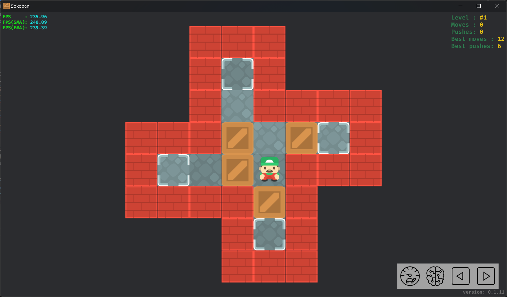
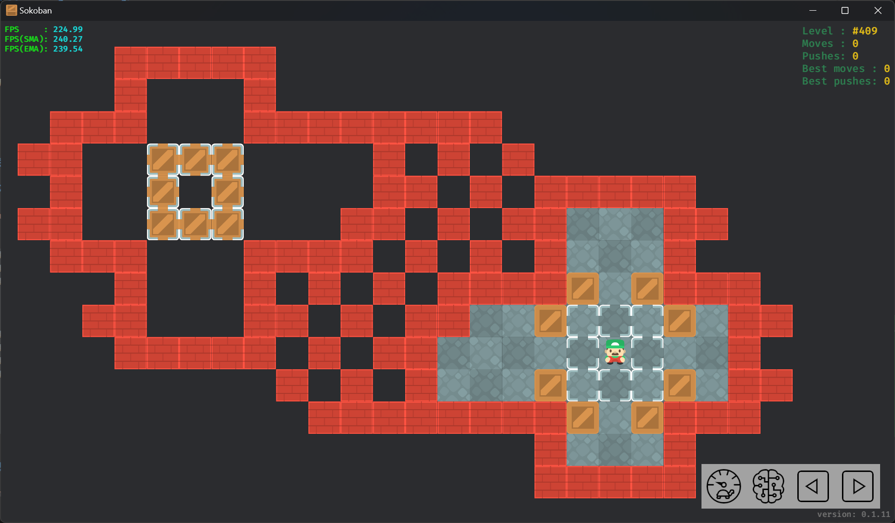
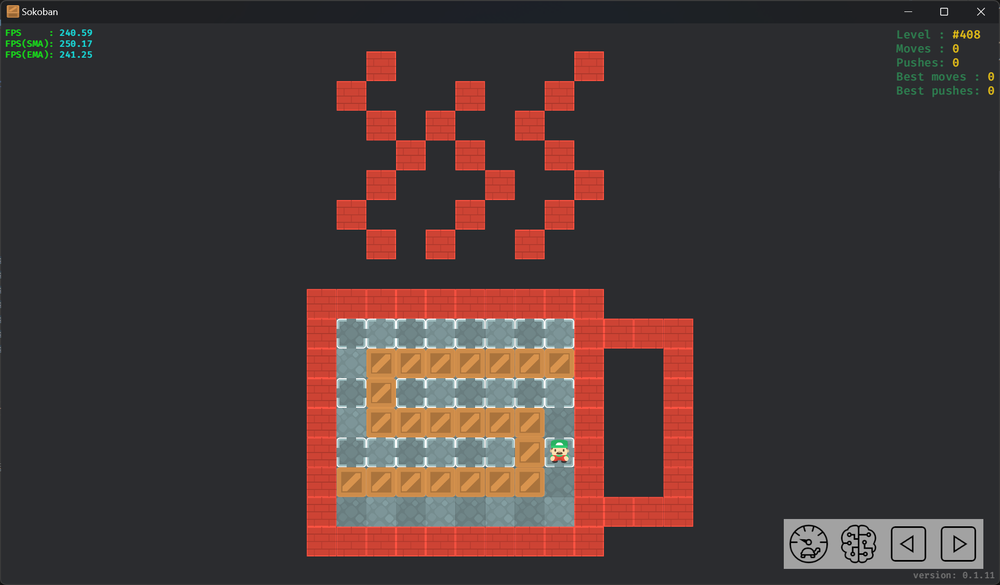
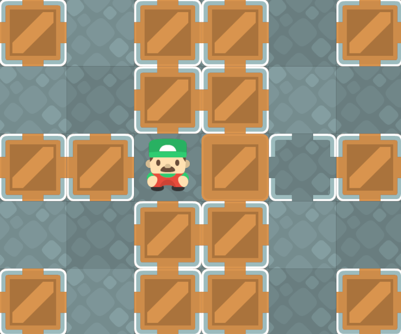

# 关卡

## XSB 格式

推箱子关卡所使用的 XSB 格式因其简洁和直观而受到了广泛的认可和应用, 最初由 XSokoban 所使用. 该格式使用 ASCII 字符来表示地图元素, 并支持注释和附加元数据.  
以关卡 `Boxworld #1` 为例:



其 XSB 格式关卡的数据如下:

```txt
;Level 1
__###___
__#.#___
__#-####
###$-$.#
#.-$@###
####$#__
___#.#__
___###__
Title: Boxworld 1
Author: Thinking Rabbit
```

上面的关卡数据大致可分为以下几种:

- 第 1 行, 单行注释, 以 `;` 开头.
- 第 2-9 行, 地图数据, 使用 ASCII 字符表示.
- 第 10-11 行, 元数据, 包括关卡标题和作者的信息.

### 地图数据

| ASCII 符号        | 描述             |
| ----------------- | ---------------- |
| `<SPACE>`/`-`/`_` | 地板             |
| `#`               | 墙体 🧱            |
| `$`               | 箱子 📦            |
| `.`               | 目标 🎯            |
| `@`               | 玩家 👷            |
| `+`               | 位于目标上的玩家 |
| `*`               | 位于目标上的箱子 |

其中地板一共使用了三种符号表示, 是因为连续的空格在某些在线论坛或邮件中可能被截断, 因此使用连字符(`-`)和下划线(`_`)来替代.

### 元数据

第 10 行的 `Title: Boxworld 1` 可以解释为键为 `title` (不区分大小写), 值为 `Boxworld 1` 的元数据.  
还有一种用于多行注释的特殊元数据. 内容通过 `comment:` 和 `comment-end:` 包裹. 这也是唯一支持值有多行的元数据.

!!! info
    多行注释还存在一种以 `comment:` 和 `comment_end:` 包裹的写法, 与之前提到的多行注释不同，这种多行注释使用下划线(`_`)来替代连字符(`-`)分割单词.  
    本文将这种格式视为**无效格式**, 其可能是在批量替换 `_` 和 `-` 字符时意外产生的.

## 游程编码 🗜️

游程编码(Run-length encoding, RLE)是无损数据压缩的一种形式, 常被应用于推箱子关卡和解决方案的压缩.

```txt
###
#.###
#*$ #
# @ #
#####
```

经 RLE 编码后可得:

```txt
3#
#.3#
#*$-#
#--@#
5#
```

可以看出, 虽然编码后的关卡有更小的体积, 但不再能直观地看出关卡的结构.

RLE 编码后的关卡通常还会使用 `|` 来分割行, 而非 `\n`. 使其看上去更加紧凑:

```txt
3#|#.3#|#*$-#|#--@#|5#
```

只需要对原本的语句进行修改即可提供对 `|` 分割行的支持:

```rs
for line in str.lines() { ... SKIP ... }

for line in str.split(['\n', '|']) { ... SKIP ... }
```

### 编码

下面是一个简单的 RLE 编码函数的实现:

```rs
pub fn rle_encode(str: &str) -> Result<String, EncodeRleError> {
    let mut result = String::new();
    let mut chars = str.chars().peekable();
    let mut count = 0;
    while let Some(char) = chars.next() {
        if char.is_numeric() {
            return Err(EncodeRleError::InvalidCharacter(char));
        }
        count += 1;
        if chars.peek() != Some(&char) {
            if count > 1 {
                result.push_str(&count.to_string());
            }
            result.push(char);
            count = 0;
        }
    }
    Ok(result)
}
```

该方法不会使用括号包裹重复的相连子串以提高压缩率.

### 解码

下面是一个 RLE 解码函数的实现:

```rs
pub fn rle_decode(str: &str) -> Result<String, DecodeRleError> {
    let mut result = String::new();

    let mut length_string = String::new();
    let mut iter = str.chars();
    while let Some(char) = iter.next() {
        if char.is_ascii_digit() {
            length_string.push(char);
            continue;
        }
        let mut token = String::new();
        if char == '(' {
            let mut nesting_level = 0;
            for char in &mut iter {
                if char == '(' {
                    nesting_level += 1;
                } else if char == ')' {
                    if nesting_level == 0 {
                        break;
                    }
                    nesting_level -= 1;
                }
                token.push(char);
            }
        } else {
            token = char.to_string();
        }
        let length = length_string.parse().unwrap_or(1);
        result += &token.repeat(length);
        length_string.clear();
    }
    if !length_string.is_empty() {
        return Err(DecodeRleError::EndWithDigits(
            length_string.parse().unwrap(),
        ));
    }
    if result.contains('(') {
        return rle_decode(&result);
    }
    Ok(result)
}
```

## 其他格式

### Sok

推箱子程序 Sokoban YASC 专用格式, 兼容 XSB 格式:

```txt
Boxworld 1

__###___
__#.#___
__#-####
###b-b.#
#.-bp###
####b#__
___#.#__
___###__

Author: Thinking Rabbit
```

请参见 [Sok format · Sokoban Wiki](http://sokobano.de/wiki/index.php?title=Sok_format).

### MF8

中文论坛魔方吧[^1]使用 MF8 格式:

```txt
[soko=8,8]
__HHH___
__H.H___
__H_HHHH
HHH$_$.H
H._$aHHH
HHHH$H__
___H.H__
___HHH__
[/soko]
```

## 特殊关卡

### 玩家不可达区域存在箱子



```txt
   #####
   #   #
 ###   ########
##  ***    # # #
 #  * *    ## # #####
##  ***   ## # ##   ##
 ###   #### # # #   #
   #   # # # ####$ $###
  ##   ## # ##  $...$ ##
   ##### # ##    .@.  #
        # # #   $...$ ##
         ########$ $###
                #   #
                #####
```

### 存在只有空元素的行



```txt
  #      #
 #   #  #
  # #  #
   # #  #
  #   #  #
 #   #  #
  # #  #
-
##########
#........####
# $$$$$$$#  #
#.$......#  #
# $$$$$$ #  #
#......$+#  #
#$$$$$$$ #  #
#        ####
##########
```

### 无完整外墙

部分推箱子程序支持无完整外墙的关卡.  
在本文中, 这种关卡属于无效关卡. 但可以通过为其添加外墙的方式来转换为有效关卡.



```txt
* ** *
  **
**@$.*
  **
* ** *
```

## 拓展资料

- <https://en.wikipedia.org/wiki/Run-length_encoding>.

## 参考

- <http://sokobano.de/wiki/index.php?title=Level_format>.

[^1]: <http://www.mf8-china.com/forum.php>
