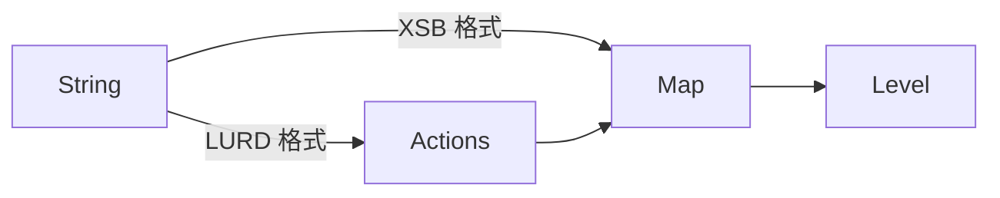

# API 设计

结构体:

- `Map`: 存储地图数据, 包括墙体和地板布局. 还有玩家位置, 箱子和目标位置, 方便快速读取.
- `Actions`: 存储玩家动作, 包括动作的类型(移动或推动), 以及方向(上下左右).
- `Level`: 关卡, 包含地图和玩家动作. 可以执行或撤销操作.

它们之间的转换关系如下:

```mermaid
flowchart LR
    A[String] -->|XSB 格式| B[Map]
    A -->|LURD 格式| C[Actions]
    B --> D[Level]
    C --> B
```
