# 构造 🏗️

## 从 XSB 格式字符串构造关卡

关卡解析可以分为两部分: 地图解析, 元数据和注释解析.

一个 XSB 格式的关卡文件中通常包含多个关卡, 不同关卡之间通过空行分割. 因此解析 XSB 格式的数据大致可分为两个步骤:

1. 多个关卡之间的分割.
2. 单个关卡的解析.

```mermaid
flowchart LR
    A[包含多个关卡的字符串] -->|Level::to_group| B
    B[包含单个关卡的字符串] --> C{是否经过\n RLE 压缩?}
    C -->|是| D[RLE 压缩字符串]
    C -->|否| E
    D -->|rle_decode| E
    E[非 RLE 压缩字符串]
```



### 多个关卡之间的分割

定义关联函数 `Level::to_groups`, 接受包含多个关卡的字符串, 返回包含单个关卡的字符串切片的迭代器.

```rs
impl Level {
    // ... SKIP ...

    fn to_groups(str: &str) -> impl Iterator<Item = &str> + '_ {
        str.split(['\n', '|']).filter_map({
            let mut offset = 0;
            let mut len = 0;
            let mut in_block_comment = false;
            let mut has_map_data = false;
            move |line| {
                len += line.len() + 1;

                let trimmed_line = line.trim();
                if !in_block_comment && (trimmed_line.is_empty() || offset + len == str.len() + 1) {
                    let group = &str[offset..offset + len - 1];
                    offset += len;
                    len = 0;
                    if group.is_empty() || !has_map_data {
                        return None;
                    }
                    has_map_data = false;
                    Some(group)
                } else {
                    if in_block_comment {
                        if trimmed_line.to_lowercase().starts_with("comment-end") {
                            // Exit block comment
                            in_block_comment = false;
                        }
                        return None;
                    }
                    if let Some(value) = trimmed_line.to_lowercase().strip_prefix("comment:") {
                        if value.trim_start().is_empty() {
                            // Enter block comment
                            in_block_comment = true;
                        }
                        return None;
                    }
                    if has_map_data || !is_xsb_string(trimmed_line) {
                        return None;
                    }

                    has_map_data = true;

                    None
                }
            }
        })
    }
}
```

出于性能方面的考虑, 解析关卡数据时应该**减少不必要的动态内存分配**:

- 由于函数 `Level::to_groups` 仅对输入字符串进行解析, 不涉及修改操作, 因此其参数类型为字符串切片 `&str`, 类似 C++ 中的 `std::string_view`.  
- 单个关卡的数据是连续的, 因此可以使用字符串切片来表示, 无需再使用 `String` 来存储地图数据.

以上方法通过直接引用原始字符串避免了内存分配, 减少内存占用的同时提高了执行效率. 而且还使得对内存的访问更加局部化.

返回迭代器是因为可以利用迭代器的**惰性求值**, 来惰性的分割关卡.  

这种实现方式有以下优点:

- 支持流式读取并构造关卡. 例如, 通过利用 `BufReader`[^2] 支持从大文件中逐步地加载关卡数据, 避免了内存的大量占用和性能瓶颈.
- 读取第 n 个关卡. 跳过前 n-1 个关卡, 只对第 n 个关卡的数据进行解析. 可以加快从多个关卡中加载单个关卡的速度.

```rs
impl Level {
    pub fn load(str: &str) -> impl Iterator<Item = Result<Self, ParseLevelError>> + '_ {
        Self::to_groups(str).map(Self::from_str)
    }

    pub fn load_nth(str: &str, id: usize) -> Result<Self, ParseLevelError> {
        let group = Self::to_groups(str).nth(id - 1).unwrap();
        Self::from_str(group)
    }
    
    // ... SKIP ...
}
```

这样便实现的关卡的惰性解析. 比如搜索完全一致的关卡:

```rs
let str = "..."; // 海量关卡
for level in Level::load(&fs::read_to_string(path).unwrap()).filter_map(|x| x.ok()) {
    // ... SKIP ...
}
```

若循环体在循环的过程中通过 `break` 语句提前退出循环, 未被循环到的关卡将不会被解析, 从而减少不必要的计算.

值得注意的是, 虽然在一些编程语言中 `Level::load_nth` 的实现是多余的, 但在 Rust 中, 迭代器先 `map` 后 `nth` 与先 `nth` 后 `map` 并**不等价**, 前者会执行 n 次 `map`, 而后者只会执行一次 `map`, 显著提高了效率.

### 单个关卡的解析

#### 解析元数据和注释

定义一个关联函数 `Level::from_str`, 作为 `Level` 的构造函数. 该函数只负责解析关卡的元数据和注释, 地图数据的进一步解析则由 `Map::from_str` 负责:

```rs
impl Level {
    pub fn from_str(str: &str) -> Result<Self, ParseLevelError> {
        // ... SKIP ...
        Ok(Self {
            map: Map::from_str(/* ... SKIP ... */)?,
            metadata,
            // ... SKIP ...
        })
    }
    // ... SKIP ...
}
```

关联函数 `Level::from_str` 需要将元数据存储到 `HashMap` 容器中, 同时提取地图数据后续交给 `Map::from_str` 做进一步解析.  
由于地图数据是连续的, 所以也可以使用字符串切片表示.

```rs
impl Level {
    pub fn from_str(str: &str) -> Result<Self, ParseLevelError> {
        let mut map_offset = 0;
        let mut map_len = 0;
        let mut metadata = HashMap::new();
        let mut comments = String::new();
        let mut in_block_comment = false;
        for line in str.split_inclusive(['\n', '|']) {
            if map_len == 0 {
                map_offset += line.len();
            }

            let trimmed_line = line.trim();
            if trimmed_line.is_empty() {
                continue;
            }

            // Parse comments
            if in_block_comment {
                if trimmed_line.to_lowercase().starts_with("comment-end") {
                    // Exit block comment
                    in_block_comment = false;
                    continue;
                }
                comments += trimmed_line;
                comments.push('\n');
                continue;
            }
            if let Some(comment) = trimmed_line.strip_prefix(';') {
                comments += comment.trim_start();
                comments.push('\n');
                continue;
            }

            // Parse metadata
            if let Some((key, value)) = trimmed_line.split_once(':') {
                let key = key.trim().to_lowercase();
                let value = value.trim();

                if key == "comment" {
                    if value.is_empty() {
                        // Enter block comment
                        in_block_comment = true;
                    } else {
                        comments += value;
                        comments.push('\n');
                    }
                    continue;
                }

                if metadata.insert(key.clone(), value.to_string()).is_some() {
                    return Err(ParseLevelError::DuplicateMetadata(key));
                }
                continue;
            }

            // Discard line that are not map data (with RLE)
            if !is_xsb_string(trimmed_line) {
                if map_len != 0 {
                    return Err(ParseMapError::InvalidCharacter(
                        trimmed_line
                            .chars()
                            .find(|&c| !is_xsb_symbol_with_rle(c))
                            .unwrap(),
                    )
                    .into());
                }
                continue;
            }

            if map_len == 0 {
                map_offset -= line.len();
            }
            map_len += line.len();
        }
        if !comments.is_empty() {
            debug_assert!(!metadata.contains_key("comments"));
            metadata.insert("comments".to_string(), comments);
        }
        if in_block_comment {
            return Err(ParseLevelError::UnterminatedBlockComment);
        }
        if map_len == 0 {
            return Err(ParseLevelError::NoMap);
        }

        Ok(Self {
            map: Map::from_str(&str[map_offset..map_offset + map_len])?,
            metadata,
            // ... SKIP ...
        })
    }
    // ... SKIP ...
}
```

在处理过程中, 注释内容被特别识别, 并作为键为 `comments` 的元数据, 一同存储到 `Level::metadata` 中.

#### 解析地图数据

解析地图数据可以分为以下几个部分:

1. **去除多余空白**: 首先, 移除每行右侧的空白字符. 随后, 确定地图左侧的最小缩进量(即每行左侧空白字符的最小数量), 并据此剔除左侧的多余空白.
2. **确定地图尺寸**: 与 MF8 格式不同, XSB 格式并不直接附带地图尺寸数据, 因此需要通过解析关卡地图数据来确定地图尺寸.
3. **RLE 解码**: 如果地图数据经过 RLE 编码, 进行解码操作.
4. **解析地图数据**: 地图数据使用 `Tiles` 表示, 写入缓冲区中.
5. **填充地板**: 使用洪水填充算法从玩家位置开始, 以墙为边界填充地板.

```rs
impl Map {
    pub fn from_str(str: &str) -> Result<Self, ParseMapError> {
        debug_assert!(!str.trim().is_empty(), "string is empty");

        // Calculate map dimensions and indentation
        let mut indent = i32::MAX;
        let mut dimensions = Vector2::<i32>::zeros();
        let mut buffer = String::with_capacity(str.len());
        for line in str.split(['\n', '|']) {
            let mut line = line.trim_end().to_string();
            if line.is_empty() {
                continue;
            }
            // If the `line` contains digits, perform RLE decoding
            if line.chars().any(char::is_numeric) {
                line = rle_decode(&line).unwrap();
            }
            dimensions.x = dimensions.x.max(line.len() as i32);
            dimensions.y += 1;
            indent = indent.min(line.chars().take_while(char::is_ascii_whitespace).count() as i32);
            buffer += &(line + "\n");
        }
        dimensions.x -= indent;

        let mut instance = Map::with_dimensions(dimensions);

        // Parse map data
        let mut player_position: Option<Vector2<_>> = None;
        for (y, line) in buffer.lines().enumerate() {
            // Trim map indentation
            let line = &line[indent as usize..];
            for (x, char) in line.chars().enumerate() {
                let position = Vector2::new(x as i32, y as i32);
                instance[position] = match char {
                    ' ' | '-' | '_' => Tiles::empty(),
                    '#' => Tiles::Wall,
                    '$' => {
                        instance.box_positions.insert(position);
                        Tiles::Box
                    }
                    '.' => {
                        instance.goal_positions.insert(position);
                        Tiles::Goal
                    }
                    '@' => {
                        if player_position.is_some() {
                            return Err(ParseMapError::MoreThanOnePlayer);
                        }
                        player_position = Some(position);
                        Tiles::Player
                    }
                    '*' => {
                        instance.box_positions.insert(position);
                        instance.goal_positions.insert(position);
                        Tiles::Box | Tiles::Goal
                    }
                    '+' => {
                        if player_position.is_some() {
                            return Err(ParseMapError::MoreThanOnePlayer);
                        }
                        player_position = Some(position);
                        instance.goal_positions.insert(position);
                        Tiles::Player | Tiles::Goal
                    }
                    _ => return Err(ParseMapError::InvalidCharacter(char)),
                };
            }
        }
        if instance.box_positions.len() != instance.goal_positions.len() {
            return Err(ParseMapError::BoxGoalMismatch);
        }
        if instance.box_positions.is_empty() {
            return Err(ParseMapError::NoBoxOrGoal);
        }
        if let Some(player_position) = player_position {
            instance.player_position = player_position;
        } else {
            return Err(ParseMapError::NoPlayer);
        }

        instance.add_floors(instance.player_position);

        Ok(instance)
    }
    // ... SKIP ...
}
```

其中部分*验证解决方案*步骤能发现的错误也可以在*模拟玩家移动*的步骤中提前发现, 但为了保持代码的简洁, 这里不做检查.

#### 性能测试

| 项目               | 平均耗时  |
| ------------------ | --------- |
| 加载 3371 个关卡   | 23.714 ms |
| 加载第 3371 个关卡 | 3.2700 ms |

根据数据, 可以得出以下结论:

1. 加载单个关卡的平均耗时约 7 μs.
2. 加载 n 个关卡和加载第 n 个关卡的耗时存在显著差异, 说明后者确实有性能的提升.

#### 错误处理

在解析地图数据的过程中, 应该关注可能发生的错误, 并进行相应的检查.  
幸运的是, 许多常见的错误都可以在解析数据的同时顺便进行排查, 这样只会带来极小的额外开销, 从而确保地图的正确性和完整性.

```rs
#[derive(Error, Clone, Eq, PartialEq, Debug)]
pub enum ParseLevelError {
    // ... SKIP ...
}

#[derive(Error, Clone, Eq, PartialEq, Debug)]
pub enum ParseMapError {
    // ... SKIP ...
}

impl From<ParseMapError> for ParseLevelError {
    fn from(error: ParseMapError) -> Self {
        ParseLevelError::ParseMapError(error)
    }
}
```

重载 `ParseMapError` 到 `ParseLevelError` 的转换, 以便 `Level::from_str` 直接返回 `Map::from_str` 中的错误.  
遵循 Rust API Guidelines (C-GOOD-ERR)[^1] 的建议, 应该为错误类型实现 `Debug` / `Error` 和 `Display` 等 trait. 本文使用库 `thiserror`[^3] 来自动完成这一步骤.

## 从解决方案构造关卡

从解决方案构造关卡可以分为以下几个部分:

1. **确定地图尺寸**: 地图的尺寸等于玩家移动范围加上 1, 以包含外墙.
2. **模拟玩家移动**: 模拟玩家的移动, 并记录三组数据, 分别是: *当前箱子位置*和箱子初始位置.

    玩家只能在地板上移动, 因此将玩家移动到的位置设为地板.
    若玩家推动了箱子, 且该箱子移动前的位置不再*当前箱子位置*中, 添加到箱子位置中.
    箱子当前位置在模拟结束后, *当前箱子位置*即最终箱子位置. 若解决方案正确, 那么最终箱子位置与目标位置相同.

3. **添加墙壁**: 在地板周围添加墙壁, 以形成完整的关卡结构.
4. **验证解决方案**: 在构造的关卡里验证解决方案的有效性. 若验证失败, 则表示解决方案不正确.

```rs
impl Map {
    pub fn from_actions(actions: &Actions) -> Result<Self, ParseMapError> {
        let mut min_position = Vector2::<i32>::zeros();
        let mut max_position = Vector2::<i32>::zeros();

        // Calculate the dimensions of the player's movement range
        let mut player_position = Vector2::zeros();
        for action in &**actions {
            player_position += &action.direction().into();
            min_position = min_position.zip_map(&player_position, |a, b| a.min(b));
            max_position = max_position.zip_map(&player_position, |a, b| a.max(b));
        }

        // Reserve space for walls
        min_position -= Vector2::new(1, 1);
        max_position += Vector2::new(1, 1);

        if min_position.x < 0 {
            player_position.x = min_position.x.abs();
        }
        if min_position.y < 0 {
            player_position.y = min_position.y.abs();
        }

        let dimensions = min_position.abs() + max_position.abs() + Vector2::new(1, 1);
        let mut instance = Map::with_dimensions(dimensions);

        // The initial position of boxes are the box positions, and the final position
        // of boxes are the goal positions
        let mut initial_box_positions = HashSet::new();
        let mut final_box_positions = HashSet::new();

        let mut final_player_position = player_position;
        for action in &**actions {
            instance[final_player_position] = Tiles::Floor;
            final_player_position += &action.direction().into();
            if action.is_push() {
                // The player pushed the box when moving, which means there is a box at the
                // player's current location
                if !final_box_positions.contains(&final_player_position) {
                    final_box_positions.insert(final_player_position);
                    initial_box_positions.insert(final_player_position);
                }
                final_box_positions.remove(&final_player_position);
                final_box_positions.insert(final_player_position + &action.direction().into());
            }
        }
        instance[final_player_position] = Tiles::Floor;

        let box_positions = initial_box_positions;
        let goal_positions = final_box_positions;
        if box_positions.is_empty() {
            return Err(ParseMapError::NoBoxOrGoal);
        }

        instance[player_position].insert(Tiles::Player);
        for box_position in &box_positions {
            instance[*box_position].insert(Tiles::Box);
        }
        for goal_position in &goal_positions {
            instance[*goal_position].insert(Tiles::Goal);
        }

        instance.add_walls_around_floors();

        instance.player_position = player_position;
        instance.box_positions = box_positions;
        instance.goal_positions = goal_positions;

        // Verify solution
        let mut level = Level::from_map(instance.clone());
        for action in &**actions {
            level
                .do_move(action.direction())
                .map_err(|_| ParseMapError::InvalidActions)?;
        }

        Ok(instance)
    }
}
```

[^1]: <https://rust-lang.github.io/api-guidelines/interoperability.html#error-types-are-meaningful-and-well-behaved-c-good-err>
[^2]: <https://doc.rust-lang.org/std/io/struct.BufReader.html>
[^3]: <https://docs.rs/thiserror/latest/thiserror/>
