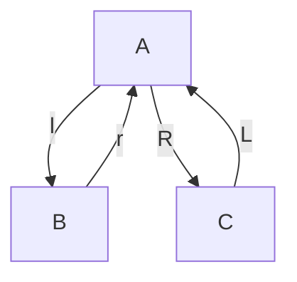
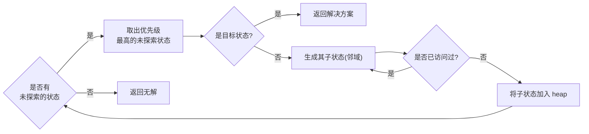

# 求解器(Solver)

顾名思义, 求解器是用于自动求解推箱子关卡的程序.

阅读本文前, 读者需要自行了解搜索算法的工作原理. 因为相比推箱子求解, 一般的寻路算法更适合读者理解搜索算法.

## 图(Graph)

以下面关卡为例:

```txt
######
# @$.#
######
```

该关卡存在三种状态, 分别为:

```txt
A:        B:        C:
######    ######    ######
# @$.#    #@ $.#    #  @*#
######    ######    ######
```

为了更直观地展示这些状态之间的转换关系, 可以用图的形式表示为:



这是一个以状态(State)为节点(Vertex), 动作(Action)为边(Edge)的有向图(Directed graph).  
其中 $A$ 为初始状态(Initial state, IS), $C$ 为目标状态(Goal state, GS), `l` 和 `r` 分别表示玩家向左和向右移动, `R` 和 `L` 分别表示玩家向右推动和向左拉动.

理论上, 状态 $C$ 还可以衍生出更多子状态, 但因为其是目标状态, 搜索算法无需继续搜索, 因此这里不再展开.

求解器的工作是进行空间状态搜索[^1], 即首先根据初始状态生成推箱子关卡的图, 然后在这个图中寻找从初始状态到目标状态的路径. 以上图为例, 就是寻找从状态 $A$ 到状态 $C$ 的路径, 即 `R`.

寻路算法是在**路径点**组成的图中寻找一条从**初始位置**到**目标位置**的路径.  
求解器则是在**状态**组成的图中寻找一条从**初始状态**到**目标状态**的路径, 即移动箱子的顺序.

下面将详细探讨如何利用搜索算法来找到这条路径.

## 搜索算法

- 广度优先搜索算法(Breadth-first search, BFS)[^2].
- A\* 搜索算法[^3]

    A\* 与 BFS 在最坏情况下的时间复杂度均为 $O(b^d)$. 但 A\* 算法是一种最佳优先搜索(Best-first search)算法, 会优先探索最有希望的节点.

- IDA* 搜索算法[^4]

    相比空间复杂度为 $O(b^d)$ 的 A\* 算法, IDA\* 算法的空间复杂度为 $O(d)$.

- FESS 搜索算法[^5]

    A\* 和 IDA\* 算法只通过单个启发式函数值值来选择下一个探索的节点.  
    虽然可以通过计算出多个启发式函数值, 将它们融合为单个启发式函数值, 以同时利用多种启发式函数, 但由于多个启发式函数值被融合为了一个, 因此无法区分单个启发式函数值的变化趋势. FESS 算法则在这方面做出了改进. 该论文的第一作者 Yaron Shoham 还将该算法应用在了求解器 Festival[^6] 上, 并取得了极佳的效果[^7].

本文不会进一步探讨 FESS 算法, 感兴趣的读者可以阅读相关论文.

BSF/A\*/IDA\* 算法均可以用于搜索最短路径, 即最佳解决方案.  
由于推箱子问题是PSPACE完全(PSPACE-complete)的, 使用 BSF 这种非启发式算法是难以搜索到解决方案的.  
而 IDA\* 算法则是基于 A\* 算法的改进, 所以本文将描述如何创建一个基于 A\* 搜索算法的求解器.

## 转置表(Transposition table)

推箱子状态构成的图是有环图, 因此需要一张转置表. 用于记录已探索过的节点, 防止重复探索相同节点或陷入死循环.

## 表示状态

状态只需要包含了玩家的位置和箱子的位置, 因为玩家和箱子是关卡中可移动对象. 保存它们的位置足以描述整个关卡的状态.  
其他元素, 如墙壁/目标位置等是静态的，它们的位置不会随状态的改变而改变, 因此只需要从关卡的初始状态中获取它们的位置.

```rs
pub struct State {
    pub player_position: Vector2<i32>,
    pub box_positions: HashSet<Vector2<i32>>,
}
```

实现从 `Map` 到 `State` 的转换:

```rs
impl From<Map> for State {
    fn from(map: Map) -> Self {
        Self {
            player_position: map.player_position(),
            box_positions: map.box_positions().clone(),
        }
    }
}
```

这样就可以将地图转为初始状态, 然后作为搜索起点开始搜索.



创建一个新的结构体用于存储到状态的代价和启发式函数值:

```rs
struct Node {
    state: State,
    cost: i32,
    heuristic: i32,
    priority: i32,
}
```

其中 `priority` 的值是根据搜索策略而计算的.

对于未探索的状态, 可以利用 `BinaryHeap` 容器来存储. 因为该容器能够高效地取出最大的元素.

通过重载 `Node` 的 `Ord` trait, 可以将状态通过优先级排序.

```rs
impl Ord for Node {
    fn cmp(&self, other: &Self) -> Ordering {
        self.priority.cmp(&other.priority).reverse()
    }
}

impl PartialOrd for Node {
    fn partial_cmp(&self, other: &Self) -> Option<Ordering> {
        Some(self.cmp(other))
    }
}
```

值得注意的是, Rust 中的 `BinaryHeap` 的实现方式是最大栈(max-heap), 因此 `BinaryHeap::pop` 函数返回的是容器中最大的元素. 而优先级的值越小表示优先级越高, 因此比较后还需要调用 `Ordering::reverse` 函数.  
这样该便可以从容器中取出优先级最高(即最小)的状态.

## 标准化玩家位置

玩家的移动会产生大量新的状态, 然而许多状态仅仅是玩家在固定区域内反复移动而未对箱子位置产生任何影响, 这些状态对于求解问题并无实质性贡献. 例如:

```txt
#####
#   ###
#  @$.#
#######
```

尽管玩家可以在箱子的左侧区域内活动, 但只有当玩家向右推动箱子时, 才能对求解做出贡献.

在移动数优先的搜索策略里, 生成仅移动的状态能确保角色以最短路径移动. 但这也可以通过更高效的最优寻路算法来实现.

因此, 如果玩家只是在一个区域内移动而不推动箱子, 对于推箱子求解是没有意义的. 为了减少这类无用状态的产生, 可以在状态中存储玩家可移动的区域和箱子的位置.

存储玩家可移动区域的一个简单且高效的实现方法是将玩家的位置标准化.  
即将玩家移动到一个特殊的位置, 比如设置到可移动区域中最左其次最上的位置. 这样在箱子布局一样的情况下, 玩家标准化位置相同就意味着玩家可达区域相同.

```rs
pub fn normalized_area(area: &HashSet<Vector2<i32>>) -> Option<Vector2<i32>> {
    area.iter()
        .min_by(|a, b| a.y.cmp(&b.y).then_with(|| a.x.cmp(&b.x)))
        .copied()
}
```

## 生成邻域

从初始状态开始探索其相邻的节点, 即邻域[^8].

通过下面函数来生成当前状态的派生状态, 即相邻的状态:

```rs
impl State {
    pub fn successors(&self, solver: &Solver) -> Vec<State> {
        // ... SKIP ...
    }
}
```

因为只有推动箱子的状态才有价值, 该函数会尝试在当前状态的基础上生成产生推动而不只是产生移动的状态.

## 搜索

一个只能判断是否有解决方案的简单实现如下:

```rs
impl Solver {
    pub fn a_star_search(&self, map: &Map) -> Result<(), SearchError> {
        let mut heap = BinaryHeap::new();
        let mut visited = HashSet::new();

        let state: State = map.clone().into();
        heap.push(Node::new(state, 0, self));

        while let Some(Node { state, cost, .. }) = heap.pop() {
            if state.is_solved(self) {
                return Ok(());
            }
            for successor in state.successors(self) {
                if !visited.insert(successor.normalized_hash(map)) {
                    continue;
                }
                heap.push(Node::new(successor, cost + 1, self));
            }
        }
        Err(SearchError::NoSolution)
    }
    // ... SKIP ...
}
```

复杂推箱子关卡的图可能存在环(Loop), 这意味着:

1. 需要记录已探索过的节点, 避免进入环中导致死循环.
2. 推箱子关卡的状态可以用图表示, 却无法用树(Tree)表示.

已被探索的节点通常会被存储在一个闭集(Closed set)中, 为了通俗易懂, 使用变量名 `visited` 表示这个闭集.  
为了节省内存, `visited` 中只需要存储已访问状态的哈希值, 因为这些状态将不会再被使用.

复杂推箱子关卡的图非常大, 难以提前生成并存储在内存中. 因此可以在搜索的过程中逐步拓展图.

[^1]: <https://en.wikipedia.org/wiki/State_space_search>
[^2]: <https://en.wikipedia.org/wiki/Breadth-first_search>
[^3]: <https://en.wikipedia.org/wiki/A*_search_algorithm>
[^4]: <https://en.wikipedia.org/wiki/Iterative_deepening_A*>
[^5]: <https://ieeexplore.ieee.org/document/9231929>
[^6]: <https://festival-solver.site/>
[^7]: <http://sokobano.de/wiki/index.php?title=Solver_Statistics>
[^8]: <https://en.wikipedia.org/wiki/Neighbourhood_(graph_theory)>
