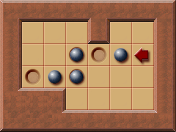
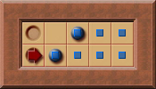

# 死锁(Deadlock)

## 什么是死锁 {#what}

推箱子的通关条件是每个箱子都被推至一个目标位置. 但在一些情况下, 箱子永远不能再被推到目标上(比如箱子被推入不是目标的死角), 导致无法通关. 这种情况称之为死锁.

## 为什么要检测死锁 {#why}

死锁检测可以用于可行性剪枝.  
死锁产生后, 该状态及其衍生状态一定无解, 求解器将浪费大量的资源去搜索一定无解的状态. 因此需要对死锁进行检测, 从而跳过这些无意义的搜索.

## 何时检测死锁 {#when}

死锁按照箱子和玩家位置的关系可以分为三类:

1. 与箱子和玩家位置无关的.
2. 与箱子位置有关和玩家位置无关的.
3. 与箱子和玩家位置有关的.

分别为:

1. **静态死锁**: 这种死锁与箱子和玩家的位置无关, 可以在只知道关卡地形和目标位置的情况下进行计算.  
    标位置是静态的, 而关卡地形可能发生变化. 比如当箱子被推到目标后死锁了, 此时可已将死锁的箱子视为不可移动的墙, 关卡地形发生变化, 需要重新计算.  
    因为地形变化只能增加墙体, 使死区变多, 所以即使不重新计算也不会产生错误, 但会使静态死锁检测不全面.

    

2. **冻结死锁(Freeze deadlocks)**: 这种死锁产生的原因是箱子和墙或箱子之间的相互阻碍导致多个箱子同时死锁.  
    这类死锁的检测时机是箱子推动后.

    

3. 包括**畜栏死锁(Corral deadlocks)**/**闭对角死锁(Closed diagonal deadlocks)**: FIXME 这类死锁和冻结死锁的区别是前者只要在箱子推动后变成了一定的模式就会产生, 而后者是否产生死锁还需要看玩家在箱子推动后的位置, 即箱子推动方向.  

    畜栏死锁是一种更为高级的冻结死锁, 因为即使在畜栏死锁后, 箱子仍然可以被推动, 但最终一定会形成冻结死锁.  
    畜栏死锁的检测时机是箱子推动后, 有玩家不可达的区域面积减小. 这意味着玩家可能无法再回到该不可达区域, 导致区域周边的箱子的移动自由度减少.

    
    

## 如何检测死锁 {#how}

### 静态死锁

将箱子放置在目标位置, 然后拉动箱子到所有可能位置. 箱子到达的区域内的箱子一定能被推动到目标, 而箱子不可达区域一定无法被推动到目标, 即死区.

### 冻结死锁

一个箱子只能在垂直和水平方向上移动, 若箱子的两个方向都被箱子遮挡(即上或下被遮挡, 且左或右被遮挡), 则该箱子处于冻结死锁.

能遮挡箱子的元素有两个:

1. 墙体.
2. 其他箱子: 需递归的判断该箱子是否被冻结死锁.

```rs
pub fn is_freeze_deadlock(
    map: &Map,
    box_position: Vector2<i32>,
    box_positions: &HashSet<Vector2<i32>>,
    visited: &mut HashSet<Vector2<i32>>,
) -> bool {
    debug_assert!(box_positions.contains(&box_position));

    if !visited.insert(box_position) {
        return true;
    }

    for direction in [
        Direction::Up,
        Direction::Down,
        Direction::Left,
        Direction::Right,
    ]
    .chunks(2)
    {
        let neighbors = [
            box_position + &direction[0].into(),
            box_position + &direction[1].into(),
        ];

        // Check if any immovable walls on the axis.
        if map[neighbors[0]].intersects(Tiles::Wall) || map[neighbors[1]].intersects(Tiles::Wall) {
            continue;
        }

        // Check if any immovable boxes on the axis.
        if (box_positions.contains(&neighbors[0])
            && is_freeze_deadlock(map, neighbors[0], box_positions, visited))
            || (box_positions.contains(&neighbors[1])
                && is_freeze_deadlock(map, neighbors[1], box_positions, visited))
        {
            continue;
        }

        return false;
    }
    true
}
```

## 参考

- <http://sokobano.de/wiki/index.php?title=Deadlocks>
