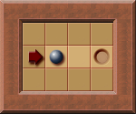
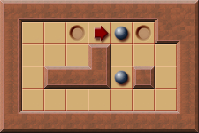
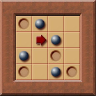
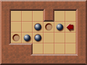
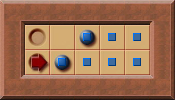
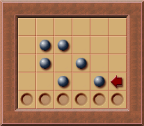

# 死锁(Deadlock)

> 本文中的死锁示例图片来源于 <http://sokobano.de/wiki>.

箱子在被推动到某个位置后, 再也无法被推动. 这种情况被称之为死锁. 如果此时被死锁的箱子不在目标上, 意味着该箱子后续无法被推动至目标上, 导致无法通关.

## 为什么要检测死锁

1. 优化求解器: 可以在搜索时进行可行性剪枝.

    若被死锁的箱子不在目标上, 那么该状态及其衍生状态一定无解.  
    部分死锁存在特定的模式, 可以通过较小的代价进行检测, 从而使求解器跳过无意义的搜索.

2. 提升玩家体验: 可以警告或防止玩家产生死锁状态.

    比如在显示箱子可达位置时不显示会产生死锁的箱子位置.

## 静态死锁



以上图为例, 暗色格子属于静态死锁区域. 若箱子被推动到这些区域则会导致该箱子永远无法再被推到目标上.

这种死锁与箱子和玩家的位置无关, 可以在只知道关卡地形和目标位置的情况下进行计算. 但关卡地形也可能发生变化:



以上图为例, 箱子向右被推入死角, 导致冻结死锁. 此时该箱子无法再被移动, 可以视作墙体, 进而导致关卡地形发生变化, 需要重新计算静态死锁区域.

这类地形变化只会增加墙体, 导致静态死锁区域增加. 因此即使不在地形变化时重新计算也不会导致误报, 但可能导致静态死锁检测不全面.

```rs
pub fn is_static_deadlock(
    map: &Map,
    box_position: Vector2<i32>,
    box_positions: &HashSet<Vector2<i32>>,
    visited: &mut HashSet<Vector2<i32>>,
) -> bool {
    debug_assert!(box_positions.contains(&box_position));

    if !visited.insert(box_position) {
        return true;
    }

    for direction in [
        Direction::Up,
        Direction::Right,
        Direction::Down,
        Direction::Left,
    ]
    .windows(3)
    {
        let neighbors = [
            box_position + &direction[0].into(),
            box_position + &direction[1].into(),
            box_position + &direction[3].into(),
        ];
        for neighbor in &neighbors {
            if map[*neighbor].intersects(Tiles::Wall) {
                continue;
            }
            if box_positions.contains(neighbor)
                && is_static_deadlock(map, *neighbor, box_positions, visited)
            {
                continue;
            }
            return false;
        }
    }
    true
}
```

## 二分死锁(Bipartite deadlocks)

静态死锁检测的是**指定箱子**能否被推动至目标上, 而二分死锁检测的是箱子能否被推动至**指定目标**上.



以上图为例, 箱子被推动至右侧, 但不属于静态死锁区域, 因为箱子看似可以继续向下推动至目标. 但将导致没有箱子能被推动至位于 $(3, 3)$ 的目标.

## 冻结死锁(Freeze deadlocks)

若一个箱子在水平和垂直方向均不可能移动且不位于目标上, 则出现冻结死锁.

判断指定箱子是否处于冻结死锁还需要**递归**的判断相邻箱子是否也处于死锁状态.  
为避免循环检查, 可以将已检查的箱子视为被死锁的, 原因如下:

如下 XSB 关卡所示, 有箱子 A, B, C. 其中 B 的左侧和下方是空地:

```txt
 A
_BC
 _
```

此时需要判断箱子 B 是否处于冻结死锁.

- 假设 B 被死锁时 A 也被死锁, 则 A 是否被死锁, 取决于 B 是否能在水平方向上移动, 即 C 是否被死锁. 需要继续检测 C 是否被死锁.
- 假设 B 被死锁时 C 也被死锁, 则 C 是否被死锁, 取决于 B 是否能在垂直方向上移动, 即 A 是否被死锁. 需要继续检测 A 是否被死锁.

如果在 B 被假设死锁时, A, C 均被死锁, 则 **B 一定被死锁**. 因为 A 被死锁意味着 B 不能在垂直方向上移动, 而 C 被死锁意味着 B 不能在水平方向上移动, 因此 B 处于冻结死锁状态.

综上所述, 将已被检测的箱子视为被死锁可以确保程序的行为正确.

如下图所示, 冻结死锁可能产生**连锁反应**, 即单个箱子被死锁后, 可能导致相连的箱子也被死锁.



```rs
pub fn is_freeze_deadlock(
    map: &Map,
    box_position: Vector2<i32>,
    box_positions: &HashSet<Vector2<i32>>,
    visited: &mut HashSet<Vector2<i32>>,
) -> bool {
    debug_assert!(box_positions.contains(&box_position));

    if !visited.insert(box_position) {
        return true;
    }

    for direction in [
        Direction::Up,
        Direction::Down,
        Direction::Left,
        Direction::Right,
    ]
    .chunks(2)
    {
        let neighbors = [
            box_position + &direction[0].into(),
            box_position + &direction[1].into(),
        ];

        // Check if any immovable walls on the axis.
        if map[neighbors[0]].intersects(Tiles::Wall) || map[neighbors[1]].intersects(Tiles::Wall) {
            continue;
        }

        // Check if any immovable boxes on the axis.
        if (box_positions.contains(&neighbors[0])
            && is_freeze_deadlock(map, neighbors[0], box_positions, visited))
            || (box_positions.contains(&neighbors[1])
                && is_freeze_deadlock(map, neighbors[1], box_positions, visited))
        {
            continue;
        }

        return false;
    }
    true
}
```

## 畜栏死锁(Corral deadlocks)



## 闭对角死锁(Closed diagonal deadlocks)



其中畜栏死锁和闭对角死锁是更高级的冻结死锁, 因为这类死锁最终会转变为冻结死锁.

## 参考

- <http://sokobano.de/wiki/index.php?title=Deadlocks>.
- <http://sokobano.de/wiki/index.php?title=How_to_detect_deadlocks>.
