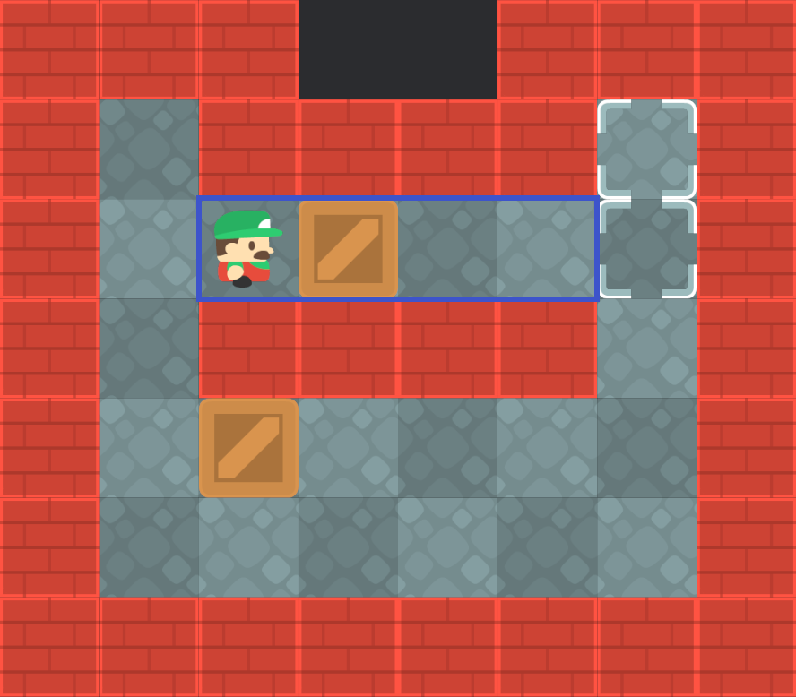

# 隧道(Tunnels)

一般情况下, 箱子的移动会产生一个新的状态, 该状态可能包含其他箱子移动所生成的子状态, 这是因为箱子之间可能存在相互影响.  
然而, 在部分关卡中, 存在一种被称为**隧道**的结构, 它可以将位于隧道内的箱子与隧道外的箱子**隔绝**, 使它们之间互不影响.

如下图所示, 其中蓝色矩形描边区域为隧道:



当上方的箱子位于隧道时, 两个箱子之间不会产生影响. 此时推动隧道内的箱子被视作**无影响力推动**(No influence pushes).

在有 $n$ 个箱子的关卡中, 每一个状态最多有 $n$ 个子状态. 但如是无影响力推动, 则无需产生对应的子状态, 应该继续推动箱子, 直到产生有影响力的推动(即该箱子离开隧道), 并产生 1 个子状态.

## 停放

将箱子推入隧道内的推动是有影响力的, 这意味这将该箱子停放到隧道内, 并为玩家和其他箱子的移动腾出空间.

单个隧道内**最多能停放一个箱子**. 因为隧道中不存在目标, 停放多个箱子会产生[畜栏死锁], 进而导致关卡无解.

隧道内**停放箱子的最佳位置是隧道入口**, 此处的隧道入口指的是距离箱子最近的隧道口.  
因为如果停放在隧道的其他位置, 玩家还需要重新返回隧道入口才能离开封闭的隧道, 这意味着玩家需要原路返回, 增加了不必要的移动步数.

## 识别

若推动后产生了如下的模式(包括旋转和镜像), 则表示箱子已经被推入隧道, 属于无效推动. 此时应该继续推动箱子, 直到箱子离开隧道, 产生具有有效推动的子状态.


下面是计算隧道的实现, 通过遍历地图, 识别符合 2 种隧道模式(包括镜像和旋转)的位置并进行标记. 计算结果可以被缓存, 以便在后续求解过程中快速判断隧道.

```rs
impl Solver {
    fn calculate_tunnels(&self) -> HashSet<(Vector2<i32>, Direction)> {
        let mut tunnels = HashSet::new();
        for x in 1..self.map.dimensions().x - 1 {
            for y in 1..self.map.dimensions().y - 1 {
                let box_position = Vector2::new(x, y);
                if !self.map[box_position].intersects(Tiles::Floor) {
                    continue;
                }

                for (up, right, down, left) in [
                    Direction::Up,
                    Direction::Right,
                    Direction::Down,
                    Direction::Left,
                ]
                .into_iter()
                .circular_tuple_windows()
                {
                    let player_position = box_position + &down.into();

                    //  .
                    // #$#
                    // #@#
                    if self.map[player_position + &left.into()].intersects(Tiles::Wall)
                        && self.map[player_position + &right.into()].intersects(Tiles::Wall)
                        && self.map[box_position + &left.into()].intersects(Tiles::Wall)
                        && self.map[box_position + &right.into()].intersects(Tiles::Wall)
                        && self.map[box_position].intersects(Tiles::Floor)
                        && self
                            .lower_bounds()
                            .contains_key(&(box_position + &up.into()))
                        && !self.map[box_position].intersects(Tiles::Goal)
                    {
                        tunnels.insert((player_position, up));
                    }

                    //  .      .
                    // #$_ or _$#
                    // #@#    #@#
                    if self.map[player_position + &left.into()].intersects(Tiles::Wall)
                        && self.map[player_position + &right.into()].intersects(Tiles::Wall)
                        && (self.map[box_position + &right.into()].intersects(Tiles::Wall)
                            && self.map[box_position + &left.into()].intersects(Tiles::Floor)
                            || self.map[box_position + &right.into()].intersects(Tiles::Floor)
                                && self.map[box_position + &left.into()].intersects(Tiles::Wall))
                        && self.map[box_position].intersects(Tiles::Floor)
                        && self
                            .lower_bounds()
                            .contains_key(&(box_position + &up.into()))
                        && !self.map[box_position].intersects(Tiles::Goal)
                    {
                        tunnels.insert((player_position, up));
                    }
                }
            }
        }
        tunnels
    }

    // ... SKIP...
}
```

[畜栏死锁]: deadlocks.md#畜栏死锁corral-deadlocks

## 参考

- <http://sokobano.de/wiki/index.php?title=Solver#Tunnels>.
